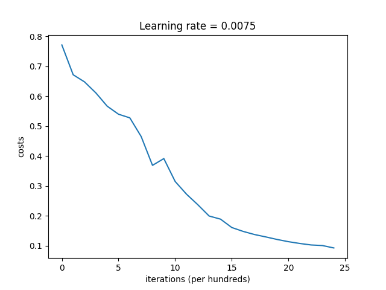
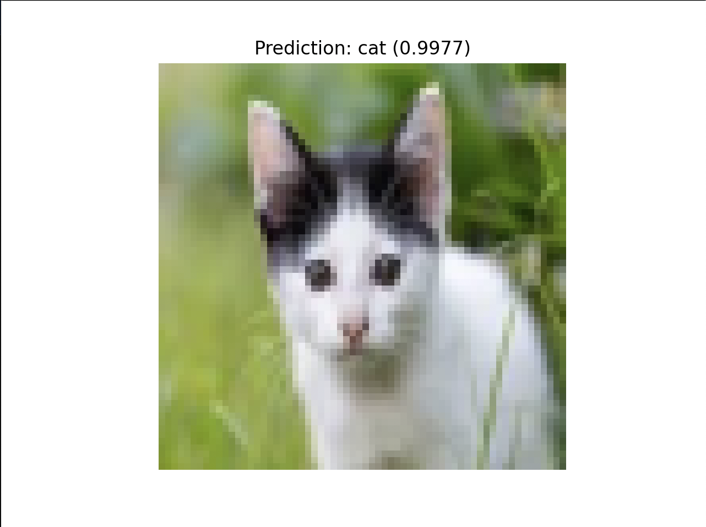

# Deep Neural Network From Scratch (NumPy)

An end-to-end implementation of an L-layer deep neural network for binary image classification using only NumPy.

## Overview

This project recreates a deep neural network from first principles without using high-level ML frameworks for model construction or training. The model is trained on the Cat vs Non-Cat dataset and supports custom image prediction.

## Features

- Implemented forward propagation from scratch
- Implemented backpropagation from scratch
- Used vectorized NumPy operations for efficient computation
- Trained a multi-layer neural network for binary image classification
- Saved and loaded trained model parameters with pickle
- Added custom image preprocessing and prediction pipeline

## Tech Stack

- Python
- NumPy
- h5py
- Matplotlib
- Pillow

## Project Structure

```text
deep-neural-network-from-scratch/
├── README.md
├── requirements.txt
├── .gitignore
├── model_params.pkl
├── data/
├── images/
├── src/
└── tests/
```

## Model Architecture

The neural network follows a fully connected architecture:

    Input (12288)
      ↓
    Dense (20) + ReLU
       ↓
    Dense (7) + ReLU
     ↓
    Dense (5) + ReLU
      ↓
    Dense (1) + Sigmoid

The final sigmoid layer outputs the probability that an image contains a cat.

---

## Training Loss

The model was trained using gradient descent with binary cross-entropy loss.



---

## Example Prediction

Below is an example of the model predicting a custom image.


